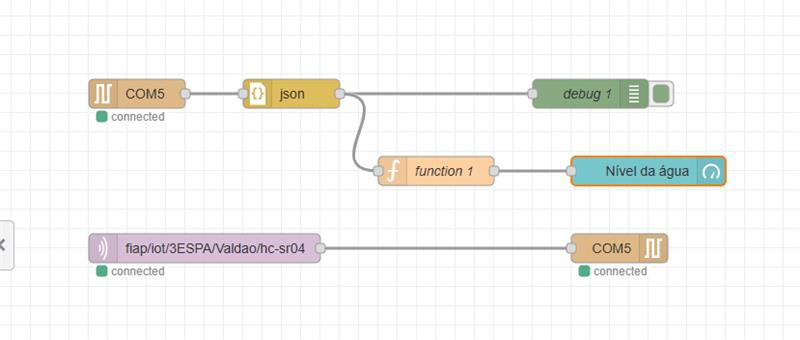
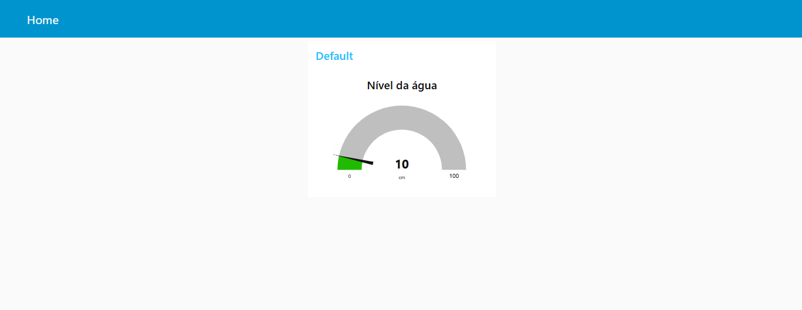
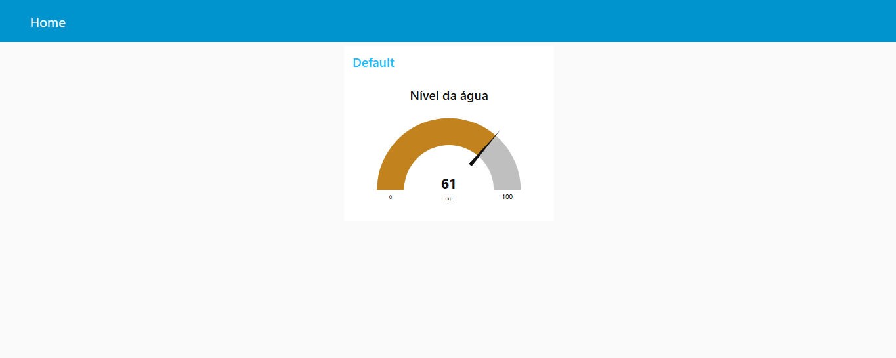
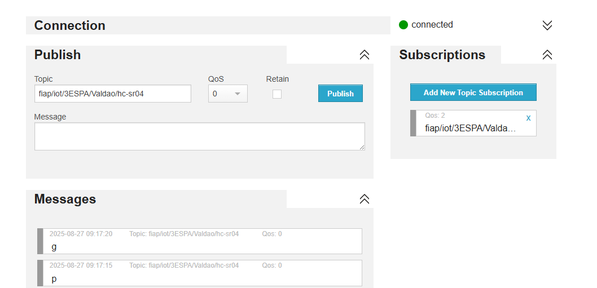

# Primeiro CheckPoint da matéria IOT-IOB.
Construção de uma solução de IoT que abrange todas os conceitos de comunicação entre Arduino, node-red e Mqtt.

## Código Arduino:
[Acessar o código do Arduino em C++](codigo.c++)

## Imagem do circuito físico:

## Fluxo node-red

## Imagem Dashboard

## Broker MQTT

## Grupo:
- Beatriz Silva, 553455;
- Carolina Machado, 552925;
- Larissa Estella, 552695;
- Lucas Masaki, 553084;
- Rafael Nascimento, 553117;